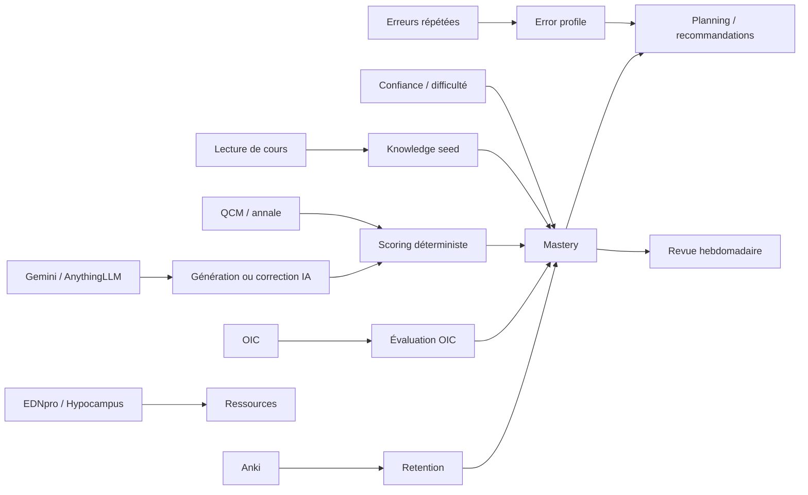
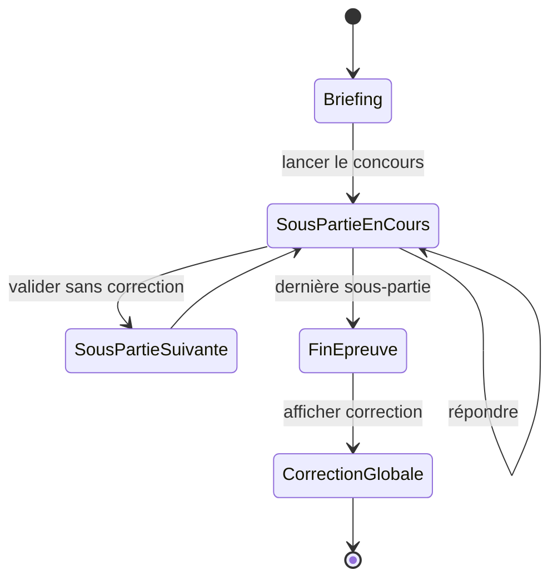

# Audit de la logique applicative, des algorithmes et de l’IA

**Projet :** Synapse  
**Date :** 9 août 2026  
**Périmètre :** pilotage des cours, maîtrise, rétention, QCM/OIC, erreurs, annales/épreuves, préparation, revue hebdomadaire, paramètres, import EDNpro/Hypocampus et générations IA.

## 1. Objectif et méthode

Ce document décrit la logique réellement présente dans le code afin de préparer la refonte UI et un audit approfondi. Il distingue :

- la donnée source et son niveau de fiabilité ;
- les règles déterministes et leurs formules ;
- les appels IA et leurs limites ;
- ce qui est calculé, ce qui est seulement affiché et ce qui n’est pas encore branché ;
- les écarts visibles dans les captures d’écran.

Les captures du dossier `ScreenTest` servent de contrôle visuel. Le code est la référence pour le fonctionnement actuel ; si une capture contredit le code, cela peut indiquer un build déployé ancien, une donnée vide ou une intégration non activée.

## 2. Vocabulaire à stabiliser

| Terme affiché | Sens technique actuel | Risque produit |
|---|---|---|
| Progression collège | Pourcentage de cours ayant une `date_1ere_lecture` | Ce n’est pas une maîtrise. |
| Progression item | Score de maîtrise ; à défaut, `100 %` si lu et `0 %` sinon | Mélange entre lecture et compétence. |
| Maîtrise | Score agrégé de plusieurs signaux, borné entre 0 et 100 | Le score n’est pas calibré sur une probabilité de réussite. |
| Statut | Niveau qualitatif dérivé du score, des lectures et des QCM | Les seuils doivent être visibles et expliqués. |
| Fragile | Niveau de maîtrise bas ou couverture Rang A insuffisante | Peut être confondu avec un retard de révision. |
| Focus semaine prochaine | Top catégories des points faibles actifs | Actuellement une recommandation, pas un plan généré complet. |
| Potentiel de gain | Heuristique de priorité relative | Ce n’est pas une prédiction statistique de gain. |

### Conclusion immédiate

La progression affichée dans la vue Collèges correspond principalement à l’avancement de lecture. Elle ne correspond pas à la maîtrise. Le tableau par item utilise toutefois un score de maîtrise lorsqu’il existe, puis retombe sur un indicateur binaire de lecture. Le même mot désigne donc deux métriques différentes.

La première correction de fond à planifier est de séparer explicitement :

1. **Avancement** : cours lus / cours disponibles ;
2. **Maîtrise** : score de connaissance ;
3. **Rétention** : niveau estimé aujourd’hui et date de prochaine révision ;
4. **Couverture OIC** : OIC Rang A/B évalués ou maîtrisés ;
5. **Performance QCM** : score et taux de réussite.

## 3. Sources de données et chaîne générale



Les principaux signaux persistés sont les lectures, sessions d’étude, résultats QCM, tentatives OIC, réponses d’annales, données Anki, reports de tâches et signaux d’erreur. Les calculs de maîtrise et de planning sont déterministes ; l’IA intervient surtout pour générer du contenu, corriger des réponses ouvertes/visuelles et classifier certains objets.

## 4. Progression des Collèges et pilotage global

### 4.1 Calcul actuel

Dans `frontend/pages/colleges_cockpit.py` :

```text
started = nombre de cours dont date_1ere_lecture est renseignée
progression = started / nombre total de cours
```

Le pilotage global affiche ensuite :

- progression de lecture ;
- nombre de cours lus ;
- révisions en retard via le service de reviews ;
- collèges fragiles via les niveaux de maîtrise ;
- cours sans PDF ;
- charge estimée en minutes.

Le calcul est utile pour suivre l’ouverture du programme, mais le libellé `Progression` laisse croire à une progression pédagogique complète.

### 4.2 Ligne item

Le tableau utilise une logique différente :

```text
si score de maîtrise disponible : progression = score
sinon si cours lu : progression = 100
sinon : progression = 0
```

Le statut est ensuite dérivé du niveau de maîtrise, ou `non_commencé` si aucun signal n’existe. Cela explique le risque de voir un item à 100 % alors qu’il est seulement lu.

### 4.3 Décalage de colonnes

Le header et les lignes partagent une grille CSS, mais la grille est écrite directement dans plusieurs sélecteurs et les contenus ont des largeurs/retours à la ligne différents. Le problème à auditer n’est donc pas seulement esthétique : il faut vérifier que le même composant de grille est utilisé pour l’en-tête, les lignes et les variantes responsive.

**Audit recommandé :** créer un composant de tableau avec une définition unique des colonnes, puis tester les états : titre long, badge, absence de QCM, écran étroit, item sans score et item avec score.

## 5. Calcul de la maîtrise

### 5.1 Sources utilisées

`backend/core/reviews/mastery.py` construit un `CourseProgressSnapshot` comprenant notamment :

- niveau qualitatif ;
- score global ;
- scores Rang A et Rang B ;
- niveau déclaré ;
- couverture OIC ;
- badge Rang A ;
- score et nombre de cartes Anki ;
- stabilité et date de rétention.

### 5.2 Cas sans activité

Les états initiaux sont différenciés :

- pas de PDF et pas de première lecture : `à préparer` ;
- PDF présent mais cours non lu, avec éventuel score initial : niveau dérivé du seed ;
- cours sans seed ni activité : `à lire` ;
- cours lu : démarrage du calcul composite.

### 5.3 Score composite actuel

Le calcul démarre à 50, puis applique des ajustements :

| Signal | Ajustement approximatif |
|---|---:|
| Une lecture | -5 |
| Deux lectures | +5 |
| Au moins trois lectures | +10 |
| Au moins deux lectures sans QCM | -4 |
| Reports | -5 par report, plafonné |
| Confiance moyenne faible | -15 |
| Confiance moyenne élevée | +10 |
| Difficulté déclarée | -10 |
| QCM raté | -15 |
| QCM tous réussis | +10 |
| QCM récent avec moins de 50 % | -15 |
| Annales moyennes au moins 80 % | +15 |
| Annales moyennes sous 50 % | -15 |

Le résultat est borné entre 0 et 100.

### 5.4 Seed et pondération de l’historique

Le service `knowledge` fournit un score initial :

```text
solide = 70
correct = 50
flou = 30
```

Ce seed décroît de 2 points par période de 30 jours, avec un plancher de 25. Il est ensuite mélangé avec le score calculé à partir des événements :

```text
w_seed = 1 / (1 + nombre_de_signaux)
score = w_seed * seed + (1 - w_seed) * score_calculé
```

Plus l’utilisateur a d’historique, moins le seed pèse. C’est logique, mais le nombre de signaux n’est pas une mesure de leur diversité ni de leur qualité : dix lectures peuvent peser comme dix preuves indépendantes.

### 5.5 Rang A et Rang B

Lorsqu’il existe une couverture OIC Rang A :

```text
score_rang_a = 50 % * score_global + 50 % * couverture_rang_a
```

En cas d’échec de session sur une catégorie Rang A, 15 points sont retirés au score Rang A. Le Rang B est ensuite estimé ainsi :

```text
si score_rang_a < 70 : score_rang_b = max(0, score_rang_a - 20)
sinon : score_rang_b = 90 % * score_global
```

Cette règle produit un indicateur pédagogique, mais pas une mesure empirique de la probabilité de réussir le Rang B. Elle devra être documentée comme heuristique ou remplacée par une calibration sur les résultats réels.

### 5.6 Niveaux affichés

Ordre de décision actuel :

```text
score < 40                         => critique
score < 60                         => fragile
score >= 80 et QCM effectué        => maîtrisé
sans QCM : 1 lecture               => en construction
sans QCM : au moins 2 lectures     => à consolider
avec QCM : score < 70              => à consolider
avec QCM : score >= 70             => maîtrisé
```

Le Rang A peut forcer un niveau inférieur si son score est insuffisant. Il faut afficher ces règles dans l’interface, par exemple avec une info-bulle `Comment est calculé ce statut ?`.

### 5.7 Points de vigilance

- Le score n’est pas calibré comme une probabilité.
- Le score global peut être élevé avec une couverture OIC Rang A faible si la UI ne montre pas le détail.
- Le score Anki est fusionné à hauteur de 25 % lorsqu’il est disponible ; AnkiConnect non utilisé signifie souvent absence de ce signal.
- Une absence de QCM peut diminuer le score, mais l’absence de preuve ne doit pas être présentée comme un échec.
- La distinction entre `lu`, `vu plusieurs fois`, `évalué` et `retenu` doit être visible.

## 6. Rétention et courbe de prédiction

### 6.1 Modèle de décroissance

`backend/core/knowledge/retention.py` utilise une courbe exponentielle avec plancher :

```text
R(t) = plancher + (score - plancher) * 2^(-jours / stabilité)
```

Valeurs structurantes :

- plancher de maîtrise : 25 ;
- stabilité maximale : 730 jours ;
- stabilité initiale variable selon la source : lecture 7 jours, manuel 14, QCM/DP/KFP/OIC 21, annale 30, etc.

La stabilité augmente après une bonne preuve et diminue après une preuve faible. Les intervalles sont donc adaptatifs, mais les coefficients sont des règles métier, pas les paramètres d’un modèle appris.

### 6.2 Ce que représente le graphique

`frontend/components/forgetting_curve.py` projette la rétention théorique du cours sans nouvelle révision, généralement sur 30 jours. Le marqueur indique la prochaine échéance calculée.

Le graphique représente donc :

```text
niveau de rétention estimé aujourd’hui -> niveau estimé dans le temps
```

Il ne représente pas directement :

- la probabilité de réussir un concours ;
- le score futur à un QCM ;
- la progression du programme ;
- la couverture des OIC ;
- une prédiction IA.

Le fallback graphique utilise une demi-vie déduite du cycle choisi, par exemple J3/J7/J14/J30. Le moteur partagé utilise un plancher 25 alors que le composant définit aussi une constante `SCORE_FLOOR = 20` non utilisée : cette divergence doit être supprimée pour éviter des courbes incohérentes.

### 6.3 Améliorations proposées

- Renommer le graphique `Rétention estimée sans révision`.
- Afficher la date et la source de la dernière preuve.
- Distinguer ligne de rétention, échéance de révision et objectif de maîtrise.
- Afficher une bande d’incertitude tant que peu de données sont disponibles.
- Mesurer ensuite la calibration : rétention prédite versus résultat réellement observé.

## 7. Projection vers l’examen et potentiel de gain

### 7.1 Trajectoire

`backend/core/edn/trajectory.py` calcule :

- les cours couverts via la première lecture ;
- le total des cours ;
- la maîtrise moyenne issue des tâches ;
- les tâches en retard ;
- le rythme récent ;
- les minutes moyennes par jour.

Le rythme récent porte sur environ 27 jours, avec un calcul des cours distincts par semaine et des minutes sur 28 jours. La projection vers l’examen applique ensuite :

```text
semaines = (date_examen - aujourd’hui) / 7
facteur_capacité = clamp(minutes_par_jour / 60, 0, 1.5)
items_projetés = couverts + rythme_récent * facteur * semaines
```

Le facteur dépend aussi d’un scénario conservateur, central ou ambitieux. La couverture est plafonnée au total.

La maîtrise projetée ajoute une fraction de la couverture gagnée, environ 15 %. C’est un indicateur directionnel, pas une simulation de réussite.

### 7.2 Potentiel de gain

`rank_gain_potential` combine habituellement :

- poids EDN ;
- marge de progression ;
- nombre d’erreurs ;
- disponibilité de questions ;
- fréquence de sessions ;
- minutes estimées ;
- pénalité de temps disponible.

Sans fréquence, la formule est une somme pondérée de ces facteurs. Avec fréquence, elle devient une combinaison multiplicative, puis est divisée par l’effort estimé. Le score sert à classer des priorités entre sujets ; il ne fournit pas une probabilité ou un nombre de points réellement gagnés.

**À documenter dans l’UI :** `Priorité relative de travail`, et non `gain prédit`, sauf calibration future sur des cohortes.

## 8. Révisions, SM-2 et planning

### 8.1 Génération des révisions

`backend/core/reviews/service.py` génère les échéances J3, J7, J14 et J30. Les tâches sont liées au contexte et à la date afin d’éviter les doublons. Les tâches terminées, ignorées ou annulées sont masquées selon le mode de consultation.

Un cours sans première lecture n’est pas proposé comme révision classique. Les reports sont conservés et pénalisent la maîtrise.

### 8.2 Mise à jour SM-2

La confiance utilisateur de 1 à 5 est transformée en note 0 à 4. La difficulté et les pièges récurrents modifient le facteur de facilité :

- échec : réduction du facteur ;
- réussite : augmentation selon la note ;
- intervalle initial : 3 jours puis 7 jours ;
- intervalle critique plafonné à 7 jours ;
- facteur de facilité minimal : 1,3.

Cette logique est explicable et déterministe. Elle doit rester séparée du score de maîtrise : une échéance SM-2 indique quand revoir, tandis que la maîtrise indique un niveau de connaissance estimé.

## 9. QCM, annales et scoring officiel

### 9.1 Scoring

`backend/core/practice/scoring.py` normalise les réponses puis applique :

- QRM/QRP : score selon le nombre de discordances, avec valeurs 1, 0,5, 0,2 ou 0 ;
- proposition indispensable absente ou proposition interdite sélectionnée : 0 ;
- QRU : exact ou faux ;
- session : moyenne des questions, convertie sur 20 ;
- Rang A valide si score au moins 14/20.

Le score officiel ne doit pas être calculé par l’IA.

### 9.2 Génération des questions

Les générateurs QCM/OIC/DP/KFP/ECOS demandent une sortie JSON structurée, avec contrôles de parsing et tentatives de reprise. En cas d’échec, certains flux utilisent un fallback générique. Le JSON doit être validé par schéma avant persistance.

### 9.3 Vue QCM

La capture QCM montre une page où titre, barre, score et statut ne partagent pas une ligne visuelle stable. Le risque est celui du tableau Collèges : données correctement calculées mais colonnes rendues avec des layouts différents.

Le composant doit être normalisé sur une grille unique avec :

```text
nom du cours | progression | score | statut | action
```

Les KPI de la page (`61,9 %`, taux de réussite, cours à retravailler) doivent avoir une définition et une période explicites.

### 9.4 Mode concours

`frontend/pages/annale_detail.py` sait lancer ou rejouer les sous-parties. Le composant de replay sait ouvrir la suivante dans le même emplacement, mais cela ne constitue pas encore un vrai mode concours continu.

Le besoin produit est un état de session distinct :



Il faut persister une session d’épreuve, verrouiller la correction jusqu’à la fin, conserver les réponses et proposer `Reprendre l’épreuve`.

### 9.5 Correction actuelle

La correction rend le prompt, les métadonnées, les réponses, les explications, la provenance et des identifiants techniques. Les UUID et IDs de proposition sont visibles dans la capture.

La règle de présentation devrait être :

- l’utilisateur voit le libellé et le texte de la proposition ;
- les IDs restent dans une zone technique facultative ;
- l’explication IA est étiquetée comme telle ;
- la correction officielle, si disponible, prime sur l’explication générée ;
- un statut de validation humaine est visible pour toute correction visuelle ou générée.

## 10. OIC : couverture, évaluation et uniformité

### 10.1 Couverture

Les OIC sont fusionnés par alias de cours, regroupés par Rang A/B, puis évalués. La couverture OIC active est calculée à partir des OIC LiSA et du nombre d’OIC maîtrisés. Le badge Rang A demande au moins un OIC Rang A et une couverture d’au moins 80 %.

### 10.2 Évaluation

Les QCM sont corrigés localement. Les réponses ouvertes sont envoyées à AnythingLLM, avec deux tentatives et un fallback faux à 0 en cas d’échec. L’agrégat est la moyenne des questions.

La progression de niveau suit une règle par seuil :

- score au moins 80 : montée, avec garde pour le niveau 5 ;
- score 50–79 : maintien ou baisse si l’historique est insuffisant ;
- score sous 50 : baisse.

Les deux évaluations précédentes sont consultées pour décider du niveau suivant. Il faut vérifier que les identifiants d’OIC sont stables et que les tentatives sont bien enregistrées en production.

### 10.3 Uniforme

La vue OIC a sa propre hiérarchie visuelle et ses propres cartes. La refonte doit définir un pattern partagé avec QCM et Collèges : même en-tête de ligne, même badge de statut, même largeur d’action et même densité.

## 11. Profil d’erreurs et points faibles

### 11.1 Catégories

Les catégories sont : `oubli`, `raisonnement`, `piège EDN`, `Rang A`, `Rang B`, `inattention`, `temps` et `non classé`.

Le profil utilise une fenêtre adaptative de 30 jours, élargie à 90 jours si moins de deux signaux sont disponibles. Les signaux sont regroupés par catégorie avec compteurs, éléments de preuve et items associés.

### 11.2 Recommandations

Une suggestion est créée lorsqu’un même item et une même catégorie ont au moins deux signaux, avec dédoublonnage des suggestions déjà proposées. L’acceptation crée un point faible et marque la suggestion acceptée.

La capture `Item 93 · non_classe` est techniquement cohérente avec le fallback, mais pédagogiquement insuffisante : `non classé` ne dit pas si l’erreur vient d’un oubli, d’un piège, du temps ou d’un défaut de classification.

### 11.3 Risques de branchement

L’audit antérieur a relevé que `error_signals` et `edn_recommendations` pouvaient être vides en production et que `insert_error_signal()` n’était pas appelé sur tous les parcours. À vérifier en priorité avec un test utilisateur complet : réponse QCM fausse → signal → agrégation → point faible → recommandation → apparition dans Points faibles.

Il existe aussi un risque de confusion entre `course_id` et `item_number` lors de l’acceptation d’une suggestion. Le contrat de stockage doit être vérifié par test d’intégration.

## 12. Revue hebdomadaire

`backend/core/analytics/weekly_report.py` calcule pour une semaine :

- durée totale ;
- nombre de sessions ;
- items améliorés et en régression ;
- lacunes résolues et nouvelles ;
- catégories faibles dominantes ;
- confiance moyenne ;
- taux de réussite QCM ;
- snapshots de maîtrise pour comparaison avec la semaine précédente.

Le `FOCUS SEMAINE PROCHAINE` correspond au top 3 des catégories de points faibles actifs. Ce n’est pas encore un programme de travail détaillé. Le bouton `Planifier ce focus` redirige vers le planning ; il ne crée pas nécessairement une séquence de tâches dédiée.

Pour rendre ce focus utile :

- expliquer les signaux qui ont déterminé la catégorie ;
- afficher les items concernés ;
- calculer une durée cible ;
- créer une session de planning identifiable ;
- afficher le suivi de réalisation.

La capture montre un focus relégué en bas à gauche. Le composant est prévu pour une largeur complète dans le code récent, ce qui impose de vérifier le build réellement servi et le parent flex/grid.

## 13. Ressources, EDNpro et Hypocampus

### 13.1 EDNpro

Le collecteur EDNpro normalise les URLs, extrait les cartes vidéo et construit des ressources associées à un item. Il ne télécharge pas les médias. Une pipeline IA complète les corrections lorsqu’une source officielle structurée n’est pas déjà disponible.

La pipeline privilégie une correction complète existante. Sinon elle génère une correction compacte, fusionne les IDs exacts des questions/propositions, normalise et persiste le résultat. Une correction visuelle doit rester soumise à validation humaine.

### 13.2 Hypocampus

Le catalogue connaît Hypocampus et fournit actuellement un raccourci vers `https://hypocampus.fr`. Une autre couche sait interroger l’API authentifiée `https://www.hypocampus.fr` avec JWT, mais ce n’est pas la même chose qu’un lien direct public vers le cours.

Pour ajouter le lien direct dans la vue Item, la chaîne à auditer est :

```text
item_number / alias
    -> prep_resources
    -> provider = Hypocampus
    -> resource_type + title + url + confidence
    -> bouton ressource dans le contexte Item
```

Le bouton ne doit être affiché que si l’URL est stable et associée au bon item. Il doit ouvrir une nouvelle page/onglet vers Hypocampus ; Playwright ou Chromium ne sont pas nécessaires pour le clic utilisateur.

Playwright/Chromium sont utiles uniquement pour :

- automatiser la collecte des URLs depuis une interface nécessitant JavaScript ;
- réutiliser une session authentifiée ;
- capturer des réponses réseau ou synchroniser le catalogue.

Ils ne doivent pas être embarqués dans le rendu de la vue Item. Le navigateur automatisé appartient au job d’import, avec profil persistant, gestion de session, logs et reprise.

### 13.3 Vidéo dans Ressources

Afficher seulement le titre est insuffisant. La ligne devrait présenter au minimum :

```text
badge Vidéo | titre | fournisseur | durée éventuelle | Ouvrir
```

La source et la catégorie doivent être visibles sans exposer une URL signée ou un identifiant interne.

## 14. Prépa et catalogue de ressources

Le catalogue regroupe les ressources par fournisseur et catégorie. La vue Prépa occupe normalement toute la largeur, mais les fournisseurs sont principalement séparés par une bordure horizontale. Cela explique la faible distinction perçue dans la capture.

À prévoir :

- cartes ou panneaux de fournisseur avec titre, logo/initiale, nombre de ressources et état de connexion ;
- séparation par espace, fond et hiérarchie, pas seulement par ligne ;
- état `non connecté`, `connecté`, `synchronisation en cours`, `dernière synchronisation` ;
- largeur uniforme des lignes et actions.

Les automatisations EDNpro et Hypocampus sont actuellement indiquées comme à connecter dans Paramètres. Il ne faut donc pas présenter une ressource comme disponible si elle vient seulement du raccourci racine.

## 15. Paramètres

La page rassemble connexions, calendrier, apparence, planning EDN, import UNESS, rafraîchissement LiSA/OIC, couverture DP et télémétrie. La logique est fonctionnelle mais la présentation est longue et largement dépliée.

Architecture proposée :

```text
Paramètres
├── Compte et intégrations
│   ├── Notion / Obsidian / Google Calendar
│   └── EDNpro / Hypocampus
├── Planning et notifications
├── Données pédagogiques
│   ├── Planning EDN
│   ├── Import UNESS
│   └── LiSA / OIC
├── Apparence et accessibilité
└── Données, confidentialité et télémétrie
```

Chaque section devrait avoir un résumé fermé par défaut, un état, une action principale et un lien `Détails avancés`. Les paramètres d’intégration doivent distinguer clairement : configuration locale, authentification, dernier test, dernière synchronisation et erreur.

## 16. Architecture IA et APIs

### 16.1 Routage

`backend/core/ai/routing.py` définit des tâches comme OIC, QCM, ECOS, DP, KFP, extraction de grille, correction UNESS, classification et score.

Règle actuelle :

- le score officiel est interdit à l’IA ;
- QCM/OIC/ECOS simple/classification utilisent généralement Flash Lite ;
- DP/KFP/ECOS complexe/correction difficile utilisent Flash ;
- la correction visuelle et l’extraction de grille demandent une validation humaine.

Point à vérifier : `AIService.generate()` appelle le routeur sans toujours transmettre le niveau de difficulté attendu. Une difficulté choisie par la UI peut donc ne pas influencer le modèle.

### 16.2 Gemini

`backend/core/ai/gemini_client.py` appelle l’API Gemini `generateContent` avec :

- modèle routé ;
- contexte texte tronqué à environ 12 000 caractères ;
- images encodées en base64 lorsque nécessaire ;
- réponse JSON demandée pour les tâches structurées ;
- reprises sur timeout, réseau, 429 et 5xx ;
- logs de tokens, durée, tâche et contexte.

Le contexte tronqué peut supprimer une partie d’une consigne ou d’une correction. Il faut journaliser le nombre de caractères original et final, sans enregistrer de données sensibles inutiles.

### 16.3 AnythingLLM

Les réponses ouvertes OIC sont évaluées par AnythingLLM avec deux tentatives et parsing JSON. En cas d’échec, le fallback est une réponse incorrecte à 0, ce qui est sûr pour éviter une fausse validation mais potentiellement trompeur pour l’utilisateur. La UI doit distinguer `évaluation indisponible` de `réponse incorrecte`.

### 16.4 Contrat de sortie IA

Toute sortie IA doit passer par :

```text
prompt versionné
    -> appel API
    -> parsing JSON
    -> validation de schéma
    -> contrôles métier
    -> validation humaine si nécessaire
    -> persistance avec provenance
```

Les objets générés doivent conserver : modèle, version de prompt, date, source, statut de validation, erreurs/reprises et identifiant de génération.

### 16.5 Coûts, fiabilité et audit

Le coût Gemini n’est pas le seul risque. Les risques principaux sont : latence, échec silencieux, sortie non conforme, correction non validée, manque de traçabilité et mélange entre réponse officielle et réponse générée.

L’audit doit mesurer par tâche : taux de succès au premier appel, taux de reprise, latence p50/p95, taux de JSON invalide, taux de validation humaine, taux de correction modifiée par un humain et coût estimé.

## 17. Ce qui est déterministe et ce qui est IA

| Fonction | Déterministe | IA | Validation nécessaire |
|---|:---:|:---:|:---:|
| Progression de lecture | Oui | Non | Non |
| Score QCM officiel | Oui | Non | Non |
| Niveau de maîtrise | Oui | Non | Revue des seuils |
| Courbe de rétention | Oui | Non | Calibration empirique |
| Planning SM-2 | Oui | Non | Tests de cas limites |
| Agrégation des erreurs | Oui | Non | Vérifier branchements |
| Génération QCM | Non | Oui | Schéma + contrôle qualité |
| Correction réponse ouverte OIC | Non | Oui | Statut d’incertitude |
| Correction visuelle | Non | Oui | Validation humaine obligatoire |
| Classification item | Non | Oui | Échantillon audité |
| Import EDNpro | Oui pour parsing | Possible pour complétion | Provenance |
| Import Hypocampus | Oui pour transport | Non nécessaire pour le lien | Authentification |

## 18. Plan d’audit approfondi

### A. Tests de données et branchements

1. Créer un item vierge et vérifier l’état initial.
2. Lire le cours et vérifier progression, statut et historique.
3. Faire un QCM avec erreur et vérifier score, maîtrise, signal d’erreur et point faible.
4. Répondre à un OIC ouvert et vérifier appel API, score, tentative et niveau.
5. Faire une annale en mode concours et vérifier réponses persistées puis correction différée.
6. Ajouter une ressource EDNpro/Hypocampus et vérifier l’association à l’item.
7. Vérifier les vues avec base vide, API indisponible et ressource sans URL.

### B. Tests de cohérence algorithmique

- score toujours borné entre 0 et 100 ;
- statut déterministe pour les mêmes événements ;
- score d’un cours lu non confondu avec score de maîtrise ;
- correction officielle prioritaire sur correction IA ;
- absence de réponse IA non transformée silencieusement en échec ;
- calendrier et rétention cohérents avec la même valeur de plancher ;
- projection explicitement indicative ;
- OIC Rang A non masqué par la moyenne globale.

### C. Tests IA

- JSON invalide ;
- réponse vide ;
- dépassement de contexte ;
- timeout et 429 ;
- image illisible ;
- proposition manquante ou ID inventé ;
- correction contredisant la source officielle ;
- AnythingLLM indisponible ;
- replay idempotent d’une génération ;
- traçabilité du modèle et du prompt.

### D. Tests UI issus des captures

- grille commune pour en-tête et données dans Collèges/QCM ;
- pleine largeur réelle dans Partiel, Prépa et Revue ;
- séparation EDN / matières dans Épreuves et Annales ;
- suppression des UUID de la correction utilisateur ;
- focus hebdomadaire dimensionné comme un bloc principal ;
- paramètres repliés avec statuts explicites ;
- bouton direct `Cours Hypocampus` visible uniquement quand la ressource est fiable.

## 19. Priorités de planification

### P0 — Fiabilité et compréhension

- séparer les métriques progression/maîtrise/rétention ;
- tracer le flux erreur QCM → point faible ;
- masquer les IDs techniques dans les corrections ;
- définir les états IA indisponible, non validé et fallback ;
- confirmer le contrat `course_id`/`item_number`.

### P1 — Parcours d’apprentissage

- mode concours continu avec correction à la fin ;
- lien direct Hypocampus dans les ressources Item ;
- vidéo avec badge, fournisseur et action ;
- focus hebdomadaire transformé en plan exploitable ;
- séparation EDN/matières dans Annales.

### P2 — Cohérence UI

- système de grille partagé ;
- composants de ligne communs ;
- panneaux Prépa différenciés ;
- refonte Paramètres en sections repliées ;
- pleine largeur et responsive vérifiés sur le build réellement servi.

### P3 — Calibration

- comparer score de maîtrise, rétention et résultats réels ;
- recalibrer les seuils Rang A/B ;
- apprendre ou ajuster le potentiel de gain ;
- mesurer les performances IA et le taux de correction humaine ;
- afficher une incertitude quand le volume de preuves est faible.

## 20. Questions à trancher avant la refonte

1. `Progression` doit-elle signifier lecture, maîtrise ou couverture du programme ?
2. Veut-on conserver un score heuristique 0–100 ou le transformer en probabilité calibrée ?
3. Une réponse IA non corrigée par un humain peut-elle influencer la maîtrise officielle ?
4. Le mode concours doit-il inclure une minuterie et un verrouillage strict des corrections ?
5. Hypocampus fournit-il des URLs directes par item, ou seulement un accès racine/authentifié ?
6. Le focus hebdomadaire doit-il créer automatiquement des tâches ?
7. Les données de progression doivent-elles être calculées par collège, item, OIC ou les trois avec trois libellés différents ?

## Synthèse

Le socle algorithmique est majoritairement déterministe et déjà assez explicable. Les défauts les plus importants ne sont pas uniquement des problèmes de CSS : plusieurs métriques différentes sont présentées sous des libellés proches, certains signaux peuvent ne pas être alimentés en production, et les sorties IA ne sont pas toujours distinguées visuellement d’une correction officielle.

Avant de refaire l’interface, il faut donc figer les contrats de données et les définitions de `progression`, `maîtrise`, `rétention`, `statut`, `focus` et `potentiel de gain`. Ensuite seulement, la normalisation visuelle pourra rendre les informations cohérentes sans masquer les différences de calcul.
