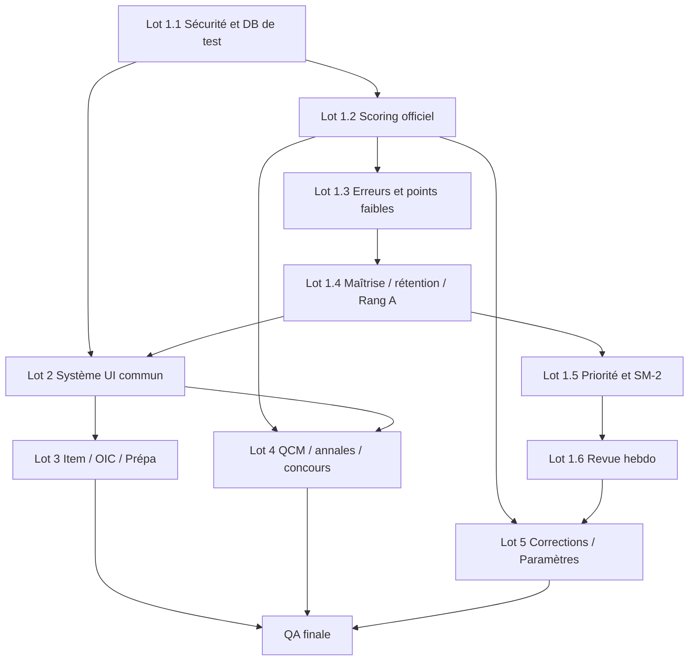

# Refonte intégrité algorithmes et UI — Implementation Plan

> **For agentic workers:** REQUIRED SUB-SKILL: Use superpowers:subagent-driven-development (recommended) or superpowers:executing-plans to implement this plan task-by-task. Steps use checkbox (`- [ ]`) syntax for tracking.

**Goal:** Rétablir la fiabilité des données pédagogiques et IA, puis harmoniser les cinq familles de vues identifiées dans les captures sans présenter comme maîtrise, prédiction ou correction officielle des signaux qui ne le sont pas.

**Architecture:** Le chantier est découpé en cinq lots indépendants, avec le lot 1 comme prérequis fonctionnel. Les contrats de données deviennent la source unique des vues ; les composants UI partagent les mêmes grilles, badges et états ; les intégrations IA restent derrière des services traçables et ne calculent jamais le score officiel.

**Tech Stack:** Python, NiceGUI, SQLite, pytest, Gemini API, AnythingLLM, Playwright/Chromium uniquement pour les collecteurs ou les tests end-to-end.

## Global Constraints

- Le score QCM EDN officiel est calculé par le moteur déterministe, jamais par l’IA.
- `maîtrise`, `rétention`, `avancement`, `couverture OIC` et `performance QCM` sont des métriques distinctes dans les contrats et dans l’UI.
- Une correction IA non validée ne peut pas alimenter la maîtrise officielle.
- Une ressource Hypocampus n’est affichée dans la vue Item que si l’association item/URL est vérifiée.
- Playwright/Chromium ne doit pas être exécuté pendant le rendu d’une vue ; il est réservé à l’import authentifié et aux tests navigateur.
- Toute migration SQLite doit être idempotente et compatible avec une base déjà existante.
- Les tests ne doivent jamais écrire dans `data/synapse_local.db`.
- Toute rotation ou purge de secret doit être précédée d’une sauvegarde vérifiée et d’un contrôle de cible.
- Les anciennes données IA et les anciennes snapshots doivent conserver leur provenance et leur version de calcul.
- Chaque tâche se termine par un test ciblé et un commit indépendant.

## Découpage produit

La demande est traitée comme cinq sous-projets :

1. **Contrats de données et branchements** : progression, maîtrise, rétention, points faibles, focus hebdo, ressources Hypocampus.
2. **Système UI commun** : grilles, colonnes, cartes, pleine largeur, statuts et badges.
3. **Vue Item/OIC/Ressources/Prépa**.
4. **QCM, annales et vrai mode concours**.
5. **Correction d’épreuve et refonte Paramètres**.

Le lot 1 est prioritaire. Les lots 2 à 5 peuvent être développés en parallèle uniquement sur des composants visuels qui ne changent pas encore la signification des métriques.

## État de référence vérifié

Au 9 août 2026, la base locale confirme :

- semaine `2026-W32` : 707 snapshots, dont 99 avec score ;
- niveaux W32 : 480 `à préparer`, 128 `à lire`, 51 `critique`, 48 `fragile`, aucun `à consolider`, `en construction` ou `maîtrisé` ;
- `error_signals` : 0 ligne ;
- `edn_recommendations` : 0 ligne ;
- `ai_practice_attempt_propositions` : 0 ligne ;
- `ai_practice_attempts` : 30 lignes avec `score_mode` vide ;
- `oic_attempts` : 3 lignes ;
- `lisa_oic.mastered = 1` : 0 ligne ;
- `ednpro_item_frequency` : 367 items, dont 335 avec fréquence non nulle et 32 à zéro ;
- `ai_usage_logs` : 1 358 lignes, dont 608 avec durée inférieure à 5 ms, à isoler avant toute analyse de performance.

Le parcours `frontend/components/qcm_replay.py` enregistre directement l’essai dans le store. La route `backend/api/qcm.py` est le seul endroit qui appelle actuellement `score_closed_attempt`, écrit les propositions et tente d’écrire les signaux d’erreur.

---

# Lot 1 — Contrats de données et branchements

**Résultat attendu :** les données affichées ont une définition stable, les producteurs réellement utilisés alimentent les tables attendues et les indicateurs sont calculés sur des signaux non confondus.

### Task 1.1: Isoler la base de test et sécuriser les logs IA

**Files:**
- Modify: `tests/conftest.py`
- Modify: `backend/core/reviews/local_store.py`
- Modify: `backend/core/ai/gemini_client.py`
- Modify: `backend/core/ai/logger.py`
- Test: `tests/test_ai_telemetry.py`
- Test: `tests/test_gemini_client.py`
- Create: `tests/test_test_database_isolation.py`

**Interfaces:**
- Produces: une fixture de test qui force une base SQLite temporaire avant tout import du store.
- Produces: une fonction de redaction interne, par exemple `_redact_provider_secrets(message: str) -> str`.
- Consumes: `local_store.log_ai_usage(...)` et les paramètres existants du client Gemini.

- [ ] **Step 1: Écrire le test d’isolation avant modification**

```python
def test_tests_do_not_use_project_database(tmp_path, monkeypatch):
    monkeypatch.setenv("SYNAPSE_TEST_DB_PATH", str(tmp_path / "test.db"))
    import backend.core.reviews.local_store as store
    assert str(store.DB_PATH) == str(tmp_path / "test.db")
```

- [ ] **Step 2: Exécuter le test ciblé et confirmer son échec**

Run: `pytest tests/test_test_database_isolation.py -q`  
Expected: FAIL because the store points to `data/synapse_local.db`.

- [ ] **Step 3: Ajouter la résolution de chemin de base avant connexion**

La résolution doit suivre cet ordre : `SYNAPSE_TEST_DB_PATH` si présent, puis le chemin de production existant. La fixture doit être installée avant les modules qui initialisent la connexion.

- [ ] **Step 4: Redacter la clé avant persistance et journalisation**

Le client doit envoyer la clé dans l’en-tête `x-goog-api-key`, supprimer `params={"key": ...}` et passer toute exception dans `_redact_provider_secrets`. Les chaînes correspondant à `key=...` sont remplacées par `key=***`.

- [ ] **Step 5: Tester la sécurité et la télémétrie**

```python
def test_gemini_error_does_not_contain_api_key(monkeypatch):
    error = "429 url?key=secret-value"
    assert "secret-value" not in _redact_provider_secrets(error)
    assert "key=***" in _redact_provider_secrets(error)
```

Run: `pytest tests/test_test_database_isolation.py tests/test_gemini_client.py tests/test_ai_telemetry.py -q`  
Expected: PASS and no test-created rows in the production database.

- [ ] **Step 6: Sauvegarder puis traiter les secrets déjà présents**

Avant toute purge, créer une copie horodatée explicitement ciblée de `data/synapse_local.db`, vérifier qu’elle est lisible, puis faire tourner la clé Gemini dans le gestionnaire de secrets utilisé par l’environnement. Purger uniquement les erreurs contenant `key=` après validation de la sauvegarde ; ne pas supprimer toute la table `ai_usage_logs`.

- [ ] **Step 7: Commit**

```text
fix: isolate test database and redact provider secrets
```

### Task 1.2: Faire du scoring EDN le chemin unique des réponses fermées

**Files:**
- Modify: `backend/core/practice/scoring.py`
- Modify: `frontend/components/qcm_replay.py`
- Modify: `backend/api/qcm.py`
- Modify: `backend/core/reviews/local_store.py`
- Test: `tests/test_practice_scoring.py`
- Test: `tests/test_qcm_replay.py`
- Test: `tests/test_qcm_api.py`
- Test: `tests/test_qcm_cockpit_persistence.py`

**Interfaces:**
- Replace/extend: `score_closed_attempt(response, choices, answer="", question_kind="QRM", indispensable_choices=(), inacceptable_choices=()) -> ScoredAttempt`.
- Produces: `ScoredAttempt.score_percent`, `score_mode="edn"`, `score_reason`, `propositions` and a question-level score distinct from each proposition’s match state.
- Consumes: `question_kind`, `choices`, `answer`, `uness.propositions`, `indispensable_choices` et `inacceptable_choices` quand présents.

- [ ] **Step 1: Ajouter les tests de contrat du barème**

```python
def test_qru_is_exact_binary():
    assert compute_question_score_edn({"A"}, {"A"}, "QRU")["score"] == 1.0
    assert compute_question_score_edn({"B"}, {"A"}, "QRU")["score"] == 0.0

def test_qrm_one_discordance_is_half():
    assert compute_question_score_edn({"A"}, {"A", "B"}, "QRM")["score"] == 0.5

def test_indispensable_and_inacceptable_are_absolute_zeroes():
    assert compute_question_score_edn({"A"}, {"A"}, indispensable_choices={"B"})["score"] == 0.0
    assert compute_question_score_edn({"A"}, {"A"}, inacceptable_choices={"A"})["score"] == 0.0
```

- [ ] **Step 2: Exécuter les tests et confirmer le défaut de passage des métadonnées**

Run: `pytest tests/test_practice_scoring.py tests/test_qcm_api.py -q`  
Expected: FAIL for QRU and indispensable/inacceptable through the route, while the low-level scorer tests expose the desired behavior.

- [ ] **Step 3: Étendre `score_closed_attempt` avec les métadonnées de question**

Le routeur doit transmettre le type de question et les contraintes de propositions. Le défaut actuel qui appelle toujours `compute_question_score_edn(..., question_kind="QRM")` doit disparaître.

- [ ] **Step 4: Remplacer le scoring binaire de `qcm_replay.py`**

Le callback `_save` ne doit plus calculer `100.0 if correct else 0.0`. Il appelle le même service de scoring que l’API, persiste `score_percent` et `score_mode`, puis persiste les propositions calculées.

- [ ] **Step 5: Corriger la granularité des propositions**

Le score de la question reste un champ unique. Les propositions exposent leur état `correct`, `omission` ou `exces` et leur correspondance attendue/sélectionnée ; elles ne recopient pas comme points individuels le score total de la question.

- [ ] **Step 6: Ajouter un test de non-contournement**

```python
def test_replay_persists_edn_score_and_propositions(fake_store):
    save_answer_from_replay(question, response="A", store=fake_store)
    attempt = fake_store.last_attempt()
    assert attempt["score_mode"] == "edn"
    assert fake_store.propositions_for(attempt["id"])
```

- [ ] **Step 7: Tester la migration des anciennes tentatives**

Les anciennes tentatives binaires restent identifiées comme `training` ou `legacy_binary`. Elles ne doivent pas être recalculées silencieusement avec une réponse incomplète.

Run: `pytest tests/test_practice_scoring.py tests/test_qcm_api.py tests/test_qcm_replay.py tests/test_qcm_cockpit_persistence.py -q`  
Expected: PASS.

- [ ] **Step 8: Commit**

```text
fix: route all closed answers through EDN scoring
```

### Task 1.3: Réparer les signaux d’erreur et leur taxonomie

**Files:**
- Modify: `backend/api/qcm.py`
- Modify: `backend/core/edn/error_profile.py`
- Modify: `backend/core/edn/gap_suggestions.py`
- Modify: `backend/core/reviews/local_store.py`
- Modify: `frontend/components/qcm_replay.py`
- Test: `tests/test_error_signal_ingestion.py`
- Test: `tests/test_error_profile.py`
- Test: `tests/test_gap_suggestions.py`

**Interfaces:**
- Create: `map_discordance_to_error_category(proposition, question, item_context) -> str`.
- Produces: uniquement `oubli`, `raisonnement`, `piege_edn`, `rang_a`, `rang_b`, `inattention`, `temps` ou `non_classe`.
- Consumes: discordance docimologique, rang OIC, type de question, signal explicite de session et métadonnées item.

- [ ] **Step 1: Écrire les cas de traduction de taxonomie**

```python
def test_omission_on_rang_a_maps_to_rang_a():
    assert map_discordance_to_error_category(
        {"discordance": "omission"}, {"question_kind": "QRM"}, {"rang": "A"}
    ) == "rang_a"

def test_unknown_mapping_is_explicit_non_classe():
    assert map_discordance_to_error_category(
        {"discordance": "exces"}, {}, {}
    ) == "non_classe"
```

- [ ] **Step 2: Brancher l’écriture sur le chemin réellement utilisé**

Après l’enregistrement d’une réponse fermée, le service unique écrit l’essai, les propositions et les signaux dans une transaction logique. La vue ne doit plus posséder une logique parallèle qui oublie les propositions.

- [ ] **Step 3: Introduire la traduction avant insertion**

`omission` et `exces` restent des observations de proposition. La catégorie cognitive est calculée par la fonction de mapping ; si les métadonnées sont insuffisantes, le résultat est explicitement `non_classe` avec une raison `classification_insuffisante`.

- [ ] **Step 4: Corriger l’acceptation d’une suggestion**

Vérifier que `course_id` reçoit l’identifiant de cours attendu par `store.add_weak_point_full` et que `item_number` reste le numéro item. Ajouter une assertion de contrat dans le test d’acceptation.

- [ ] **Step 5: Tester le flux bout en bout**

```python
def test_wrong_qcm_creates_error_and_gap_suggestion(fake_store):
    record_wrong_answer(...)
    record_wrong_answer(...)
    assert fake_store.error_signals_count() == 2
    suggestions = generate_gap_suggestions()
    assert suggestions[0]["item_number"] == "93"
```

Run: `pytest tests/test_error_signal_ingestion.py tests/test_error_profile.py tests/test_gap_suggestions.py tests/test_qcm_api.py -q`  
Expected: PASS with no production database access.

- [ ] **Step 6: Commit**

```text
fix: reconnect error signals and normalize error taxonomy
```

### Task 1.4: Séparer maîtrise, rétention et preuve Rang A

**Files:**
- Modify: `backend/core/reviews/mastery.py`
- Modify: `backend/core/knowledge/retention.py`
- Modify: `backend/core/knowledge/models.py`
- Modify: `backend/core/knowledge/service.py`
- Modify: `backend/core/reviews/local_store.py`
- Modify: `backend/core/analytics/weekly_report.py`
- Test: `tests/test_mastery_algorithm.py`
- Test: `tests/test_knowledge_mastery.py`
- Test: `tests/test_knowledge_retention.py`
- Test: `tests/test_knowledge_oic.py`
- Test: `tests/test_knowledge_no_regression.py`

**Interfaces:**
- Replace ambiguous snapshot `score` with `mastery_score: int | None` and `retention_score: int | None`.
- Preserve a temporary read-only compatibility accessor `score` only until all consumers are migrated.
- Add `rang_a_evaluated: bool` distinct from `rang_a_referential: bool`.
- Produce `MasterySnapshot.calculation_version = "v2"` for newly calculated values.

- [ ] **Step 1: Ajouter les tests de distinction**

```python
def test_mastery_does_not_decay_without_new_evidence():
    snapshot = get_course_mastery(course_with_old_success, context="college")
    assert snapshot.mastery_score == 80
    assert snapshot.retention_score < snapshot.mastery_score

def test_rang_a_referential_without_attempt_is_not_failure():
    snapshot = get_course_mastery(course_with_lisa_oic_but_no_attempt, context="college")
    assert snapshot.rang_a_referential is True
    assert snapshot.rang_a_evaluated is False
    assert snapshot.level != "critique"
```

- [ ] **Step 2: Ajouter une migration SQLite idempotente**

Étendre l’initialisation/migration de `backend/core/reviews/local_store.py` pour ajouter à `mastery_snapshots` `retention_score` et `calculation_version`. Les snapshots historiques restent lisibles et sont marqués `legacy` lorsqu’ils ne peuvent pas être séparés.

- [ ] **Step 3: Conserver le score composite de compétence avant `evaluate_retention`**

Dans `mastery.py`, la valeur calculée après seed, QCM, Anki, annales et confiance devient `mastery_score`. `evaluate_retention` reçoit cette valeur et produit uniquement `retention_score` et la stabilité.

- [ ] **Step 4: Corriger le garde Rang A**

Renommer les variables pour refléter le contrat et conditionner la pénalité Rang A à l’existence d’au moins une tentative OIC exploitable pour le cours. La présence de lignes `lisa_oic` ne constitue pas une preuve d’évaluation.

- [ ] **Step 5: Unifier les libellés et niveaux**

Les niveaux sont dérivés de `mastery_score`, tandis que l’UI peut afficher séparément `rétention actuelle`. Les seuils doivent rester dans une fonction testée, et chaque snapshot conserve la version de calcul.

- [ ] **Step 6: Corriger la rétention et le dédoublonnage**

Les preuves de même source et même date sont dédoublonnées, y compris les preuves de confiance. La croissance de stabilité est pondérée par l’intervalle réel depuis la dernière preuve, afin que plusieurs sessions le même jour ne valent pas plusieurs répétitions espacées.

- [ ] **Step 7: Tester la distribution de niveaux**

Ajouter des cas permettant d’atteindre `à consolider`, `en construction` et `maîtrisé`, puis un test de non-régression qui vérifie que la simple présence d’un référentiel OIC ne punit pas un cours non évalué.

Run: `pytest tests/test_mastery_algorithm.py tests/test_knowledge_mastery.py tests/test_knowledge_retention.py tests/test_knowledge_oic.py tests/test_knowledge_no_regression.py -q`  
Expected: PASS.

- [ ] **Step 8: Commit**

```text
refactor: separate mastery from retention and rang-a evidence
```

### Task 1.5: Rendre le potentiel de gain et SM-2 cohérents

**Files:**
- Modify: `backend/core/edn/trajectory.py`
- Modify: `backend/core/reviews/sm2.py`
- Modify: `frontend/components/edn_insights_panel.py`
- Test: `tests/test_edn_gain_priority.py`
- Test: `tests/test_edn_trajectory.py`
- Test: `tests/test_knowledge_retention.py`

**Interfaces:**
- Replace the two formula branches with one `rank_gain_potential(...)` formula whose `factors` contains weight, gap, errors, availability, frequency and effort.
- Preserve a zero-frequency item as eligible when its mastery gap is high.
- Treat confidence 3/5 as a low-quality success for scheduling, not as a hard failure.

- [ ] **Step 1: Tester les items sans fréquence**

```python
def test_item_without_frequency_is_not_zeroed_by_default():
    rows = rank_gain_potential(items=[{"item_number": "93", "mastery": 30, "frequency_sessions": 0}])
    assert rows[0]["potential_score"] > 0
```

- [ ] **Step 2: Tester que chaque facteur modifie le classement**

Comparer deux items identiques en faisant varier un seul facteur à la fois. Le test doit vérifier que le score change pour `error_count`, `edn_weight`, `available_questions`, `frequency_sessions` et `estimated_minutes`.

- [ ] **Step 3: Unifier la formule et documenter son statut**

Conserver un score de priorité relative, borné et explicable. Ne pas le nommer probabilité de gain tant qu’il n’est pas calibré sur des résultats réels.

- [ ] **Step 4: Corriger le seuil SM-2**

Tester la règle utilisateur : confiance 1–2 = échec, 3 = réussite faible, 4–5 = réussite. Ajuster le grade interne et les intervalles sans modifier les contrats des anciennes révisions déjà persistées.

- [ ] **Step 5: Exécuter et committer**

Run: `pytest tests/test_edn_gain_priority.py tests/test_edn_trajectory.py tests/test_knowledge_retention.py -q`  
Expected: PASS.

```text
fix: make study priority and SM2 use all declared signals
```

### Task 1.6: Rendre la revue hebdomadaire fidèle aux métriques

**Files:**
- Modify: `backend/core/analytics/weekly_report.py`
- Modify: `frontend/pages/revue.py`
- Test: `tests/test_weekly_report.py` if present, otherwise create it
- Test: `tests/test_revue_page.py` if present, otherwise create it

**Interfaces:**
- Produce weekly deltas for `mastery_score` and `retention_score` separately.
- Produce a focus with categories, item numbers, evidence count, estimated minutes and generated task IDs.
- Keep focus generation disabled when only `non_classe` signals exist.

- [ ] **Step 1: Tester une régression de rétention sans baisse de maîtrise**

```python
def test_weekly_report_does_not_call_retention_decay_a_mastery_regression():
    report = generate_weekly_report(current_snapshot, previous_snapshot)
    assert report.mastery_regressed_items == []
    assert report.retention_declined_items == ["ITEM-1"]
```

- [ ] **Step 2: Séparer les requêtes de snapshot**

Les comparaisons de semaine utilisent les colonnes nouvelles et n’interprètent pas les anciennes valeurs comme des scores de compétence sans version compatible.

- [ ] **Step 3: Définir le focus hebdomadaire**

Le focus est le top des catégories actives après filtrage de `non_classe`. Chaque catégorie expose les items et preuves qui la justifient. La génération de tâches est activée seulement pour une catégorie classifiée.

- [ ] **Step 4: Tester et committer**

Run: `pytest tests/test_weekly_report.py tests/test_revue_page.py -q`  
Expected: PASS.

```text
fix: separate weekly mastery and retention signals
```

---

# Lot 2 — Système UI commun

**Résultat attendu :** les vues qui affichent des lignes ou cartes utilisent les mêmes contrats de largeur, alignement, statuts et pleine largeur.

### Task 2.1: Définir les tokens et composants de ligne

**Files:**
- Modify: `frontend/design_tokens.py`
- Modify: `frontend/theme.py`
- Create: `frontend/components/data_grid.py`
- Create: `frontend/components/status_badge.py`
- Create: `frontend/components/metric_card.py`
- Test: `tests/test_b1_wrap_widths.py`
- Create: `tests/test_shared_ui_components.py`

**Interfaces:**
- `DataGrid(columns, rows, row_renderer, empty_state=None)` partage la définition de colonnes entre header et lignes.
- `StatusBadge(status, label=None, tone=None)` reçoit un statut métier, jamais une couleur brute.
- `MetricCard(label, value, helper=None, tone=None)` affiche une métrique et sa définition courte.

- [ ] **Step 1: Tester la définition unique des colonnes**

```python
def test_data_grid_uses_same_column_template_for_header_and_rows():
    grid = DataGrid(columns=["item", "progress", "status"], rows=[])
    assert grid.column_template == "grid-template-columns: minmax(180px, 2fr) 96px 120px"
```

- [ ] **Step 2: Ajouter les tokens de largeur et d’espacement**

Les tokens doivent couvrir largeur de contenu, largeur pleine, densité de ligne, espaces de section, rayon, bordure, tonalités de statut et responsive.

- [ ] **Step 3: Migrer une vue témoin**

Migrer le tableau item de `frontend/pages/colleges_cockpit.py` vers `DataGrid`. Le header et chaque ligne utilisent la même liste de colonnes.

- [ ] **Step 4: Tester les états de rendu**

Tester titre long, badge multi-mots, valeur absente, ligne sans action, écran étroit et liste vide.

- [ ] **Step 5: Commit**

```text
feat: add shared data grid and status components
```

### Task 2.2: Standardiser largeur, panneaux et responsive

**Files:**
- Modify: `frontend/cockpit_shell.py`
- Modify: `frontend/pages/colleges_cockpit.py`
- Modify: `frontend/pages/qcm_cockpit.py`
- Modify: `frontend/pages/prepa.py`
- Modify: `frontend/pages/revue.py`
- Test: `tests/test_colleges_cockpit_ui.py`
- Test: `tests/test_qcm_cockpit_ui.py`
- Test: `tests/test_prepa_page.py`

**Interfaces:**
- Produce: wrappers `page_width="full" | "readable"` et `panel_density="compact" | "comfortable"`.
- Consume: les tokens du composant `DataGrid` sans styles locaux divergents.

- [ ] **Step 1: Ajouter les tests de largeur minimale**

Vérifier que Collèges, QCM, Prépa et Revue utilisent la classe pleine largeur lorsque leur contenu est tabulaire ou multi-colonnes. Vérifier également que les conteneurs ne possèdent pas un `max-width` contradictoire.

- [ ] **Step 2: Remplacer les grilles locales**

Les sélecteurs de grille des headers et lignes sont supprimés au profit du composant partagé. Les actions restent alignées dans une dernière colonne fixe.

- [ ] **Step 3: Tester le rendu sans navigateur**

Run: `pytest tests/test_colleges_cockpit_ui.py tests/test_qcm_cockpit_ui.py tests/test_prepa_page.py tests/test_revue_page.py -q`  
Expected: PASS.

- [ ] **Step 4: Commit**

```text
refactor: standardize cockpit widths and data layouts
```

---

# Lot 3 — Vue Item, OIC, Ressources et Prépa

**Résultat attendu :** une vue Item uniforme, avec ressources explicites, OIC lisibles et fournisseurs Prépa visuellement différenciés.

### Task 3.1: Résoudre et afficher le lien direct Hypocampus

**Files:**
- Modify: `backend/core/prep/resources.py`
- Modify: `backend/core/prep/catalog.py`
- Modify: `frontend/components/context_panel.py`
- Modify: `frontend/components/course_card.py`
- Test: `tests/test_prep_resources.py`
- Test: `tests/test_item_resource_panel.py`
- Test: `tests/test_prep_catalog.py`

**Interfaces:**
- Create: `list_verified_item_resources(item_number: str, provider: str | None = None) -> list[PrepResource]`.
- Produce: `PrepResource(provider, resource_type, title, url, item_number, confidence, source_url)`.
- Consume: `prep_resources` avec `confidence >= 0.8` et URL normalisée.

- [ ] **Step 1: Tester la règle d’affichage**

```python
def test_hypocampus_link_is_shown_only_when_item_match_is_verified():
    assert render_resources([resource(provider="Hypocampus", confidence=0.95)]).has_link("Hypocampus")
    assert not render_resources([resource(provider="Hypocampus", confidence=0.4)]).has_link("Hypocampus")
```

- [ ] **Step 2: Distinguer raccourci racine et lien item**

Le raccourci `https://hypocampus.fr` reste un accès fournisseur. Il ne doit pas être présenté comme `Cours de l’item` tant qu’une URL directe par item n’est pas résolue.

- [ ] **Step 3: Ajouter le bouton dans `context_panel.py`**

Afficher `Cours Hypocampus` uniquement lorsqu’un `PrepResource` vérifié est retourné. Ouvrir l’URL dans un nouvel onglet. Aucun appel Playwright/Chromium pendant ce rendu.

- [ ] **Step 4: Vérifier empiriquement le collecteur**

Dans un job séparé, tester une session authentifiée sur 10 items témoins. Mesurer le taux de résolution directe, les redirections et la stabilité des URLs. Si le taux n’est pas 100 %, ne pas afficher le bouton direct et conserver le raccourci racine.

- [ ] **Step 5: Tester et committer**

Run: `pytest tests/test_prep_resources.py tests/test_item_resource_panel.py tests/test_prep_catalog.py -q`  
Expected: PASS.

```text
feat: expose verified Hypocampus item resources
```

### Task 3.2: Rendre les vidéos explicites

**Files:**
- Modify: `backend/core/ednpro/collector.py`
- Modify: `backend/core/prep/resources.py`
- Modify: `frontend/components/context_panel.py`
- Test: `tests/test_ednpro_collector.py`
- Test: `tests/test_item_resource_panel.py`

- [ ] **Step 1: Normaliser le type vidéo**

Les ressources vidéo portent `resource_type="video"`, le fournisseur, le titre, la durée si disponible et une URL stable.

- [ ] **Step 2: Afficher le badge et les métadonnées**

Rendre une ligne `Vidéo · titre · fournisseur · durée éventuelle · Ouvrir`. Ne jamais afficher une URL signée ou un UUID comme libellé principal.

- [ ] **Step 3: Tester le titre manquant et l’URL invalide**

Une vidéo sans titre reçoit le libellé `Vidéo EDNpro` ; une vidéo sans URL stable est conservée dans l’import mais masquée de l’action utilisateur.

- [ ] **Step 4: Commit**

```text
feat: label item video resources with provider and type
```

### Task 3.3: Uniformiser la vue OIC et distinguer les Prépa

**Files:**
- Modify: `frontend/components/oic_panel.py`
- Modify: `frontend/components/oic_eval_dialog.py`
- Modify: `frontend/pages/course_detail_cockpit.py`
- Modify: `frontend/pages/course_detail.py`
- Modify: `frontend/pages/prepa.py`
- Test: `tests/test_course_detail_oic_tab.py`
- Test: `tests/test_oic_panel_data.py`
- Test: `tests/test_prepa_page.py`

- [ ] **Step 1: Réutiliser les composants de statut**

Les rangs A/B, niveaux et états OIC utilisent `StatusBadge` et les mêmes espacements que les lignes QCM/Collèges.

- [ ] **Step 2: Recomposer les fournisseurs Prépa en panneaux**

Chaque fournisseur devient un panneau avec en-tête, état de connexion, compteur, dernière synchronisation et catégories. Une simple bordure horizontale ne suffit plus.

- [ ] **Step 3: Garantir la pleine largeur**

Le catalogue et les groupes de ressources utilisent le wrapper `page_width="full"` avec une grille responsive stable.

- [ ] **Step 4: Tester et committer**

Run: `pytest tests/test_course_detail_oic_tab.py tests/test_oic_panel_data.py tests/test_prepa_page.py -q`  
Expected: PASS.

```text
refactor: unify OIC and preparation resource layouts
```

---

# Lot 4 — QCM, annales et vrai mode concours

**Résultat attendu :** les listes QCM/annales sont uniformes et une épreuve peut être réalisée de bout en bout sans correction intermédiaire.

### Task 4.1: Séparer EDN et matières dans Annales

**Files:**
- Modify: `frontend/pages/annales.py`
- Modify: `frontend/pages/annale_detail.py`
- Modify: `backend/core/reviews/local_store.py` si le filtre doit être persisté
- Test: `tests/test_annales_page.py`
- Test: `tests/test_annale_detail_page.py`

- [x] **Step 1: Définir le filtre métier**

Le type d’annale est normalisé dans une valeur `EDN` ou `Matière`, avec un état `Tous` explicite. Le filtre ne dépend pas du texte de présentation.

- [x] **Step 2: Remplacer l’onglet visuellement faible**

Utiliser deux segments ou deux panneaux clairement titrés `Épreuves EDN` et `Épreuves par matière`, avec compteurs et état vide propre à chaque groupe.

- [x] **Step 3: Tester les filtres et la sélection**

```python
def test_annales_are_grouped_by_exam_family():
    view = render_annales([annale(type="EDN"), annale(type="Matière")])
    assert view.group("Épreuves EDN").count == 1
    assert view.group("Épreuves par matière").count == 1
```

- [x] **Step 4: Commit**

```text
feat: separate EDN and subject annales
```

### Task 4.2: Créer une session d’épreuve continue

**Files:**
- Modify: `frontend/pages/annale_detail.py`
- Modify: `frontend/components/qcm_replay.py`
- Modify: `frontend/pages/exam_simulator_page.py`
- Modify: `backend/core/reviews/local_store.py`
- Test: `tests/test_annale_detail_page.py`
- Test: `tests/test_exam_simulator_scoring.py`
- Test: `tests/test_qcm_cockpit_replay.py`

**Interfaces:**
- Create: `ExamSessionState(session_id, annale_id, subpart_ids, current_index, mode, started_at, completed_at)`.
- Create: `start_exam_session(annale_id) -> ExamSessionState`.
- Create: `advance_exam_session(session_id, response) -> ExamSessionState`.
- Create: `complete_exam_session(session_id) -> ExamResult`.

- [ ] **Step 1: Tester le cycle sans correction**

```python
def test_exam_session_advances_without_showing_correction():
    session = start_exam_session(annale_id=1)
    next_state = advance_exam_session(session.session_id, response={"A"})
    assert next_state.current_index == 1
    assert next_state.mode == "exam"
    assert not next_state.correction_visible
```

- [ ] **Step 2: Ajouter la persistance idempotente de session**

La base conserve l’épreuve, les sous-parties, les réponses, l’index courant, le statut `draft|in_progress|completed` et les timestamps. Recharger la page reprend la session existante.

- [ ] **Step 3: Verrouiller correction et score intermédiaire**

En mode concours, ne pas rendre réponse correcte, explication, score question ou bouton de correction avant `completed`.

- [ ] **Step 4: Afficher le résultat global à la fin**

À la dernière sous-partie, afficher `Terminer l’épreuve`, calculer le résultat avec le scoring EDN réparé puis proposer `Voir la correction` et `Reprendre` si la session n’est pas terminée.

- [ ] **Step 5: Tester interruption et reprise**

Run: `pytest tests/test_annale_detail_page.py tests/test_exam_simulator_scoring.py tests/test_qcm_cockpit_replay.py -q`  
Expected: PASS.

- [ ] **Step 6: Commit**

```text
feat: add continuous exam session mode
```

### Task 4.3: Harmoniser la vue QCM

**Files:**
- Modify: `frontend/pages/qcm_cockpit.py`
- Modify: `frontend/components/practice_session_card.py`
- Modify: `frontend/components/qcm_replay.py`
- Test: `tests/test_qcm_cockpit_ui.py`
- Test: `tests/test_qcm_replay.py`

- [ ] **Step 1: Migrer la liste sur `DataGrid`**

Colonnes fixes : `Cours`, `Avancement`, `Score`, `Statut`, `Action`. Le header et les lignes utilisent le même template.

- [ ] **Step 2: Définir les KPI**

Chaque KPI affiche sa période, son dénominateur et un lien d’explication. `Taux de réussite ≥70 %` ne doit pas être confondu avec le score moyen.

- [ ] **Step 3: Tester les données manquantes**

Les états sans QCM, avec score legacy et avec score EDN s’affichent différemment et ne recourent pas à `100 %` par défaut.

- [ ] **Step 4: Commit**

```text
refactor: align QCM list metrics and actions
```

---

# Lot 5 — Correction d’épreuve, Revue et Paramètres

**Résultat attendu :** les corrections sont pédagogiques et lisibles, la Revue utilise toute la largeur et les Paramètres sont structurés par domaines.

### Task 5.1: Nettoyer la correction d’épreuve

**Files:**
- Modify: `frontend/components/qcm_replay.py`
- Modify: `frontend/pages/annale_detail.py`
- Modify: `backend/core/uness/normalizer.py`
- Modify: `backend/core/uness/models.py`
- Test: `tests/test_qcm_replay.py`
- Test: `tests/test_exam_provenance.py`
- Test: `tests/test_gemini_autocorrect.py`

**Interfaces:**
- Produce: un modèle de correction avec `display_text`, `correctness`, `official_explanation`, `generated_explanation`, `source_label`, `validation_status` et `technical_ids` masqués par défaut.
- Consume: les IDs techniques uniquement pour les liens internes et le mode diagnostic.

- [ ] **Step 1: Tester l’absence d’UUID dans le rendu principal**

```python
def test_correction_hides_technical_ids_by_default():
    rendered = render_correction(correction_with_uuid)
    assert "Pourquoi ?" in rendered.text
    assert "uuid" not in rendered.visible_text.lower()
```

- [ ] **Step 2: Séparer correction officielle et IA**

La correction officielle est prioritaire. Une correction générée affiche son statut `IA non validée`, `validée humainement` ou `indisponible`.

- [ ] **Step 3: Recomposer les onglets**

Les onglets `Réponse correcte` et `Pourquoi ?` utilisent une mise en page par proposition : libellé, état, explication, provenance. Les identifiants sont accessibles dans un panneau technique séparé.

- [ ] **Step 4: Tester les fallbacks**

Une réponse IA vide, tronquée ou indisponible affiche `Explication indisponible`, jamais une réponse incorrecte implicite sans contexte.

- [ ] **Step 5: Commit**

```text
refactor: present exam corrections without technical identifiers
```

### Task 5.2: Structurer la Revue hebdomadaire

**Files:**
- Modify: `frontend/pages/revue.py`
- Modify: `frontend/components/metric_card.py`
- Test: `tests/test_revue_page.py`

- [ ] **Step 1: Passer le focus en bloc principal pleine largeur**

Le focus utilise une ligne ou grille complète, avec catégories, preuves, items, durée et action. Il ne doit pas être rendu comme une petite carte positionnée en bas à gauche.

- [ ] **Step 2: Afficher la définition de Focus**

Sous le titre, afficher : `Top des catégories de points faibles actifs sur les 30 derniers jours`. Si aucun signal classifié n’existe, afficher un état vide expliquant pourquoi.

- [ ] **Step 3: Relier l’action au planning**

`Planifier ce focus` crée ou ouvre une séquence identifiable avec les items du focus ; il ne se contente pas de rediriger vers `/planning` sans contexte.

- [ ] **Step 4: Tester et committer**

Run: `pytest tests/test_revue_page.py tests/test_weekly_report.py -q`  
Expected: PASS.

```text
feat: make weekly focus actionable and full width
```

### Task 5.3: Refonte des Paramètres par domaines

**Files:**
- Modify: `frontend/pages/settings_cockpit.py`
- Modify: `frontend/pages/settings.py`
- Create: `frontend/components/settings_section.py`
- Test: `tests/test_settings_page.py` if present, otherwise create it
- Test: `tests/test_calendar_sources_panel.py`

**Interfaces:**
- `SettingsSection(key, title, summary, status, content, default_open=False)`.
- `IntegrationStatus(provider, connection_state, last_sync, last_error)`.

- [ ] **Step 1: Tester la structure initiale**

```python
def test_settings_sections_are_collapsed_by_default():
    view = render_settings()
    assert view.section("Intégrations").is_collapsed
    assert view.section("Données pédagogiques").is_collapsed
```

- [ ] **Step 2: Regrouper les paramètres**

Sections : `Compte et intégrations`, `Planning et notifications`, `Données pédagogiques`, `Apparence et accessibilité`, `Données et télémétrie`.

- [ ] **Step 3: Ajouter les états d’intégration**

Chaque fournisseur affiche configuration, authentification, dernière synchronisation, dernière erreur et action principale. EDNpro/Hypocampus distinguent `à connecter` d’une connexion active.

- [ ] **Step 4: Vérifier l’accessibilité et le responsive**

Les sections sont navigables au clavier, leurs boutons ont des labels explicites et la page reste pleine largeur sans créer de colonne inutilisée.

- [ ] **Step 5: Tester et committer**

Run: `pytest tests/test_settings_page.py tests/test_calendar_sources_panel.py -q`  
Expected: PASS.

```text
refactor: organize settings by domain and integration state
```

---

# Vérification transversale et livraison

### Task 6.1: Ajouter les tests de cohérence des métriques

**Files:**
- Create: `tests/test_metric_contracts.py`
- Modify: `backend/core/reviews/mastery.py` if assertions are needed
- Modify: `frontend/pages/colleges_cockpit.py`
- Modify: `frontend/pages/qcm_cockpit.py`

- [ ] **Step 1: Écrire les invariants**

```python
def test_progress_metrics_have_distinct_semantics():
    metrics = build_course_metrics(course)
    assert metrics["avancement"] == metrics["read_courses"] / metrics["total_courses"]
    assert 0 <= metrics["mastery_score"] <= 100
    assert 0 <= metrics["retention_score"] <= 100
    assert metrics["avancement"] != metrics["mastery_score"] or metrics["metric_labels"]
```

- [ ] **Step 2: Vérifier les états sans preuve**

Un cours simplement lu ne doit pas être rendu comme `maîtrisé`. Un cours avec référentiel OIC mais sans tentative ne doit pas être rendu comme échec Rang A.

- [ ] **Step 3: Vérifier les sources IA**

Une correction IA garde son modèle, sa version de prompt, son statut de validation et son origine. Une erreur de fournisseur n’est jamais rendue comme une erreur pédagogique utilisateur.

- [ ] **Step 4: Commit**

```text
test: enforce metric and AI provenance contracts
```

### Task 6.2: Exécuter la validation complète

**Files:**
- No source change expected; update failing tests discovered by the previous tasks only.

- [x] **Step 1: Exécuter les tests ciblés par lot**

Run: `pytest tests/test_mastery_algorithm.py tests/test_practice_scoring.py tests/test_error_signal_ingestion.py tests/test_qcm_api.py tests/test_item_resource_panel.py tests/test_annales_page.py tests/test_annale_detail_page.py tests/test_qcm_replay.py tests/test_prepa_page.py -q`  
Expected: PASS.

- [x] **Step 2: Exécuter la suite complète**

Run: `pytest -q`  
Expected: PASS, or a complete list of unrelated pre-existing failures with no claim of completion until resolved or explicitly accepted.

- [x] **Step 3: Contrôler la base après tests**

Vérifier que les tests ont écrit uniquement dans une base temporaire, que la base de production n’a pas reçu de ligne `ai_usage_logs` artificielle et que les tables d’erreurs de l’environnement de test restent isolées.

- [x] **Step 4: QA navigateur** *(QA technique effectuée le 2026-08-09)*

Utiliser Playwright/Chromium uniquement après les tests Python pour vérifier : alignement header/lignes, pleine largeur, mode concours, absence d’UUID, lien Hypocampus vérifié, sections Paramètres repliées et focus hebdomadaire pleine largeur.

- [x] **Step 5: Produire le rapport de livraison**

Le rapport doit inclure les tests exécutés, les migrations appliquées, les métriques avant/après, les intégrations IA testées, les URLs Hypocampus vérifiées et les limites restantes.

Rapport mis à jour dans `DEPLOYMENT_SESSION_2026-08-09.md`. Les limites de QA sont documentées dans le rapport de déploiement.

## Dépendances et ordre d’exécution



## Critères de réussite globaux

- Une réponse QCM fermée du parcours réel possède `score_mode="edn"` et une correction propositionnelle persistée.
- Deux erreurs répétées sur le même item produisent un signal classifié ou un `non_classe` explicitement justifié, puis une suggestion testable.
- Un cours peut atteindre chaque niveau de maîtrise dans les tests et la maîtrise ne décroît pas uniquement avec le temps.
- La rétention est visible séparément de la maîtrise.
- Un référentiel OIC non évalué ne déclenche pas une pénalité Rang A.
- Les métriques IA ne contiennent plus de clé dans les erreurs et les tests n’écrivent plus dans la base de production.
- Le lien Hypocampus direct n’apparaît que pour une association item/URL vérifiée.
- Les vues Collèges et QCM ont des colonnes alignées via le même composant.
- Les annales sont séparées entre EDN et matières.
- Une épreuve complète peut être réalisée sans correction intermédiaire, puis corrigée à la fin.
- Les corrections utilisateur ne montrent plus d’UUID par défaut.
- Prépa, Revue et Paramètres occupent l’espace prévu et possèdent une hiérarchie visuelle explicite.
